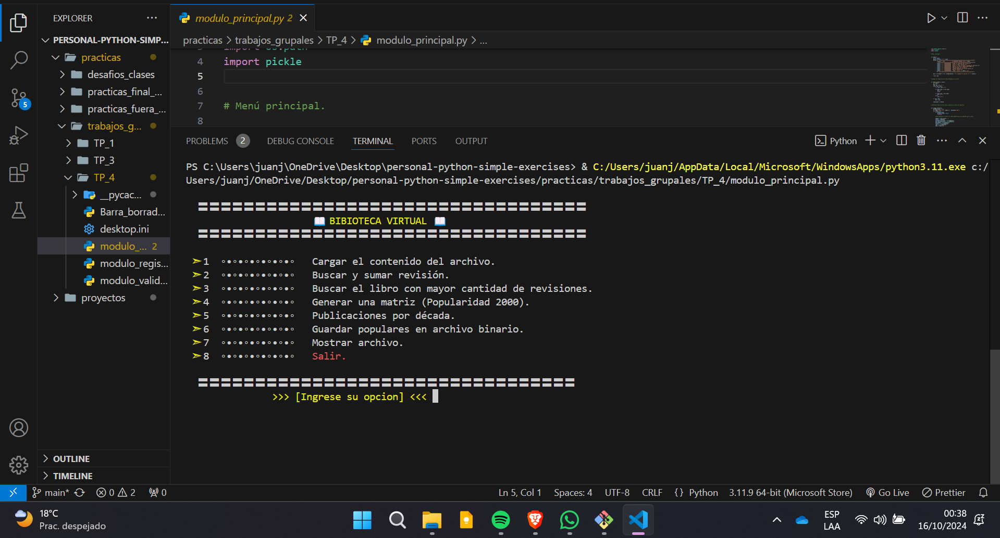
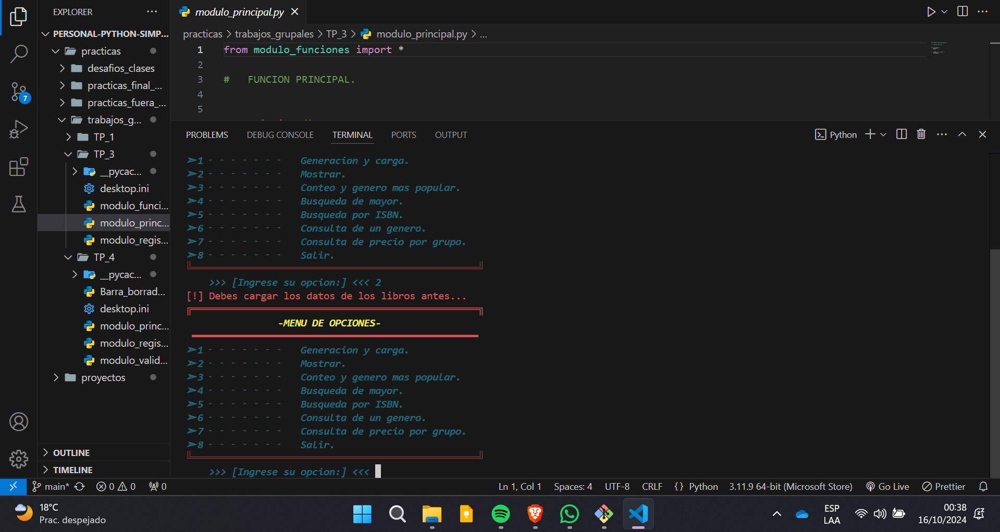
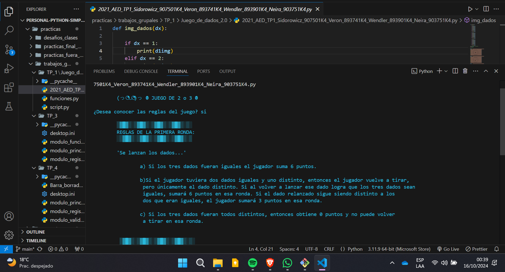
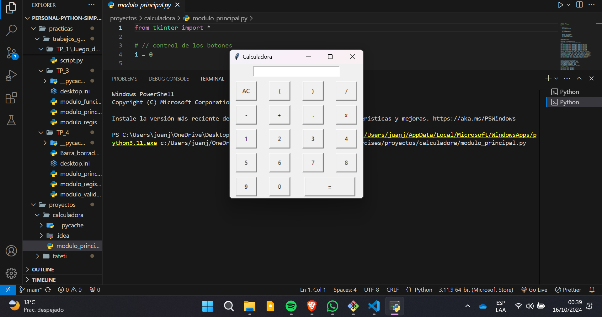

# 📚 Python Programming Practices

## 📂 Overview
Welcome to my repository of Python programming practices! 🐍 This collection features a variety of exercises and projects that showcase my journey in mastering Python. Each folder encapsulates different sets of challenges, reflecting my understanding of programming concepts and problem-solving skills. From simple scripts to more complex applications, you'll find a diverse range of projects that highlight my growth as a developer.

## 🌟 Why Python?
Python is a versatile and powerful programming language that emphasizes readability and simplicity. It is widely used in various domains, including web development, data analysis, artificial intelligence, scientific computing, and more. My aim with these projects is to solidify my foundational knowledge while experimenting with different features and libraries.

## 🛠️ Technologies Used
- **Python 3.x**: The primary programming language for all projects.
- **Common Libraries i worked with**:
  - **os.path**: A built-in module that provides functions for manipulating file paths, enabling seamless navigation and file management within my projects.
  - **pickle**: A powerful module for serializing and deserializing Python objects, allowing for easy storage and retrieval of complex data structures.

## 📷 Photo Gallery
Here are some snapshots from my projects showcasing their features and interfaces:

